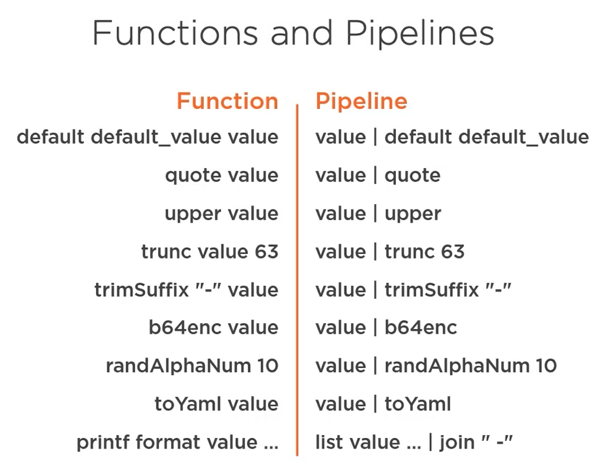
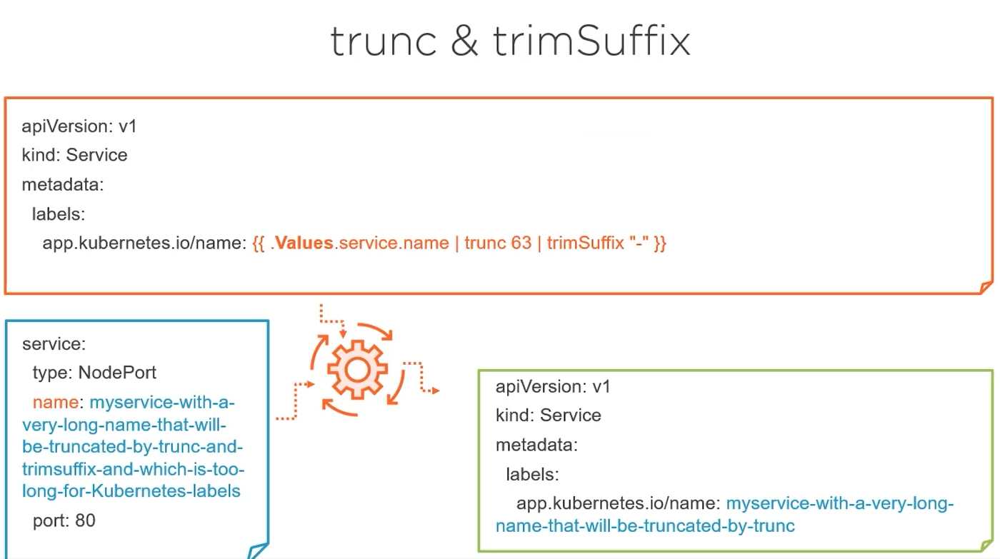
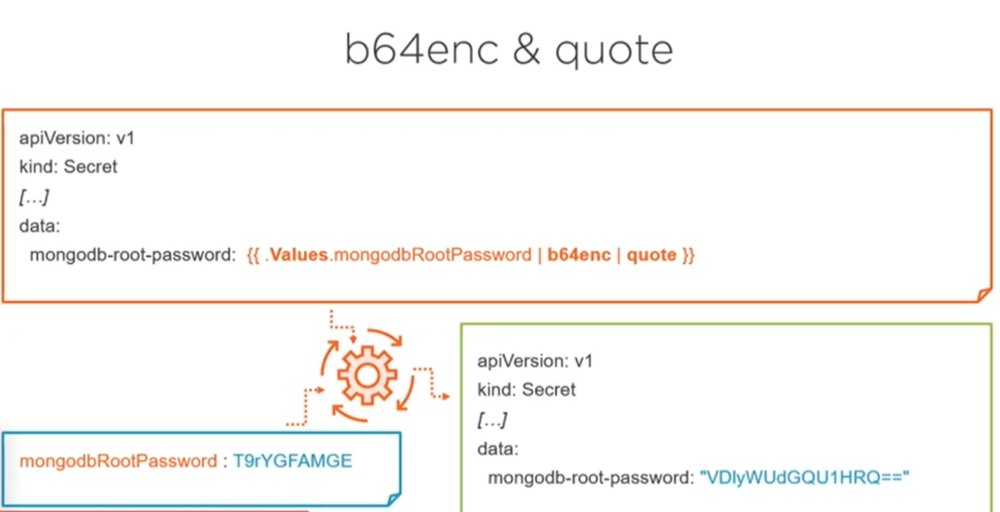
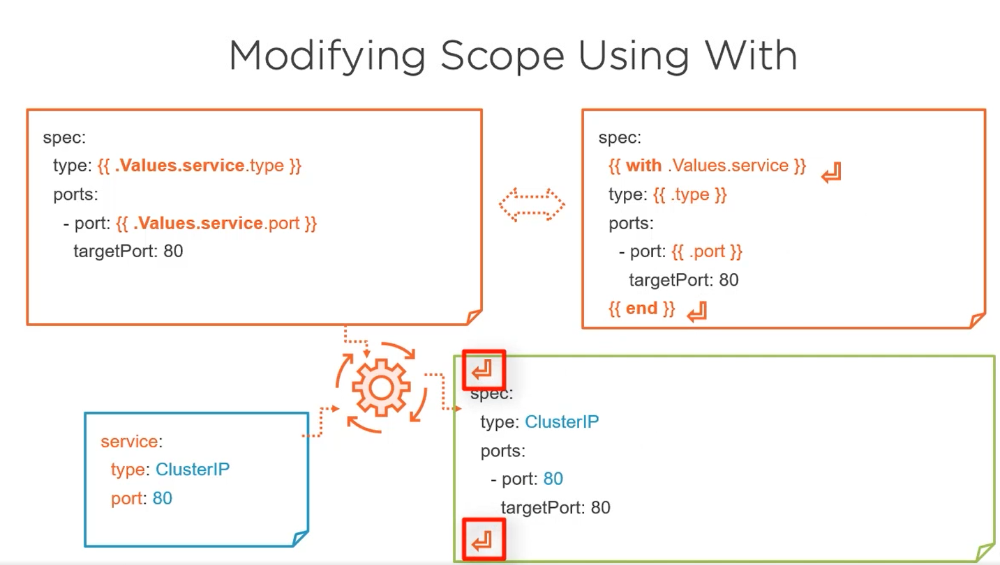
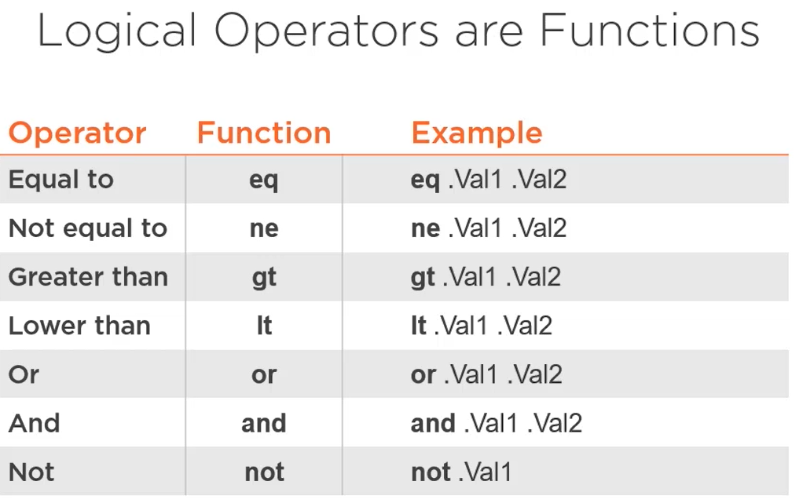
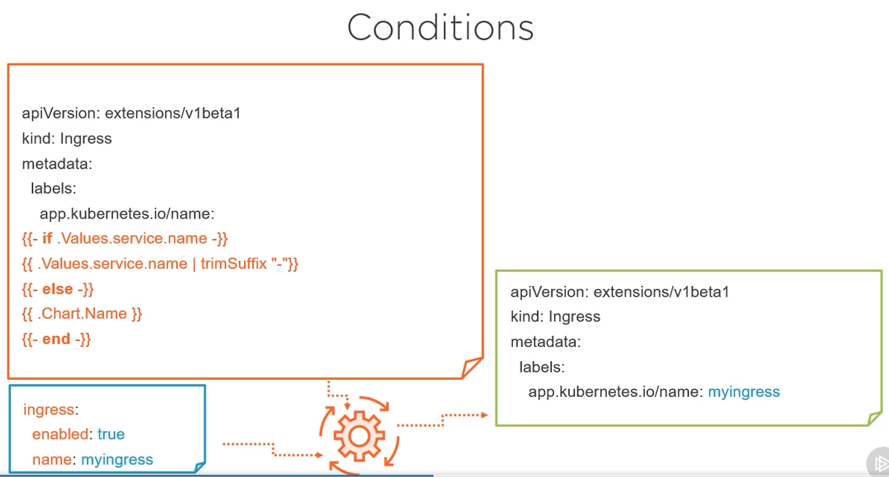
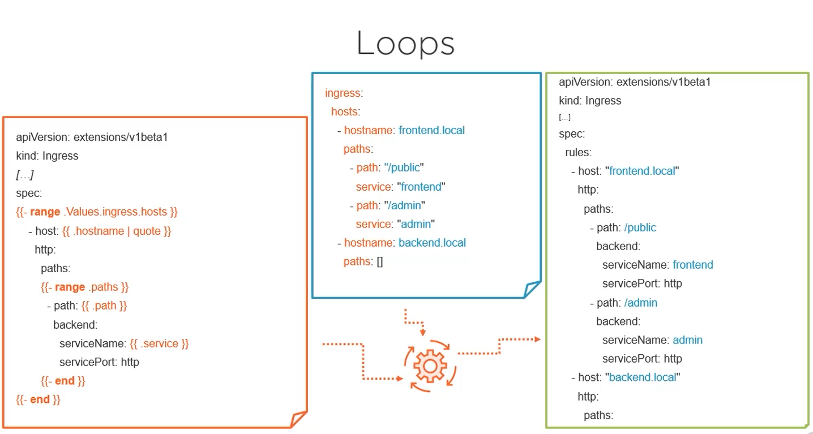

# Helm functions and pipelines

## Introduction

Helm gives us the possibility to add some logic to our charts via functions and pipelines.

You can use both, but in most of cases devops uses the pipeline syntax :

For functions, it's like in other languages but the difference with Helm is that to pass an argument you can just put a space between the function name and its parameters. For example :
- **quote value** (wich calls the quote functions with value as argument)
- **value | quote** (with pipeline you can just use)

This will add quotes to your value.

## Most used functions

Here's common used functions in Helm.

- **trunc value 63** is mostly used with long names (as kubernetes will not accept names with more than 64 characters)
- **b64enc** is mostly used with password to encode them

We will see some examples next.

You can find more functions in the Helm documentation :

- https://helm.sh/docs/chart_template_guide/functions_and_pipelines/

- https://helm.sh/docs/chart_template_guide/function_list/

These functions are provided by the **Sprig** project, so have a look also at this documentation :
- https://github.com/Masterminds/sprig/tree/master/docs

## Examples

### Trunc and trimSuffix

As the service:name has more than 64 caracters, using this technique we will truncate the name and remove the **dash** at the tail of the name (if the last trunctaed character is a hash)

### Password

In this example, we will encore the password and put it into quotes.

### With

If you don't want to precise the paths from the root each time with **.Values.service**, you can uses a scope by defining it via the **with** keyword.

A little issue here is that the with generates a return character in the manifest file. We will see the solution in the next section.

### Controlling whitespaces and Indentation

- Using the **dash**, you can control the return characters spaces.
- Using the **indent** function you can control the indentation.

Check this video for examples :
- https://app.pluralsight.com/course-player?clipId=d8fff5b4-eb00-440e-9225-8627009a3c1d

### Logical operators, if else and loops

In this video, we will talk about logical operators, how to use the if else and how to loop over an array :
- https://app.pluralsight.com/course-player?clipId=6d973518-ebfa-49dd-8b31-6d03bdc24224

