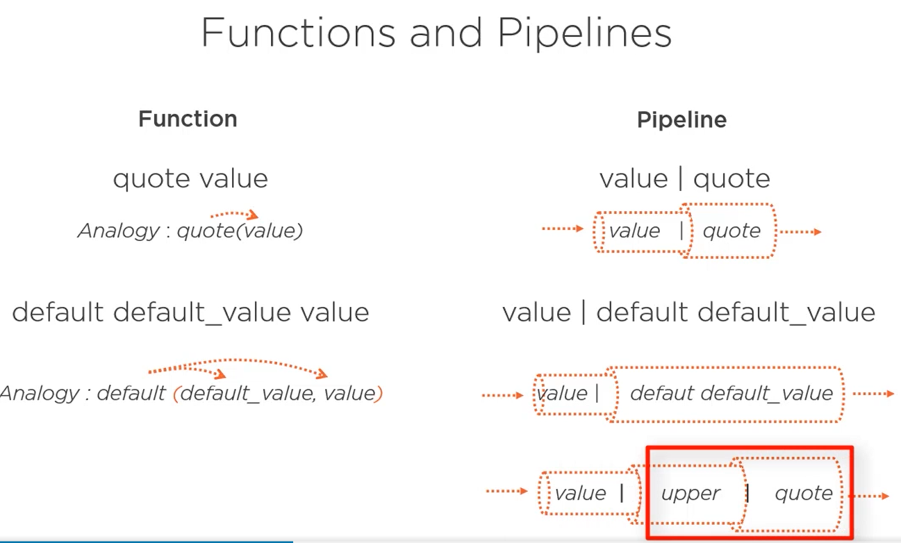
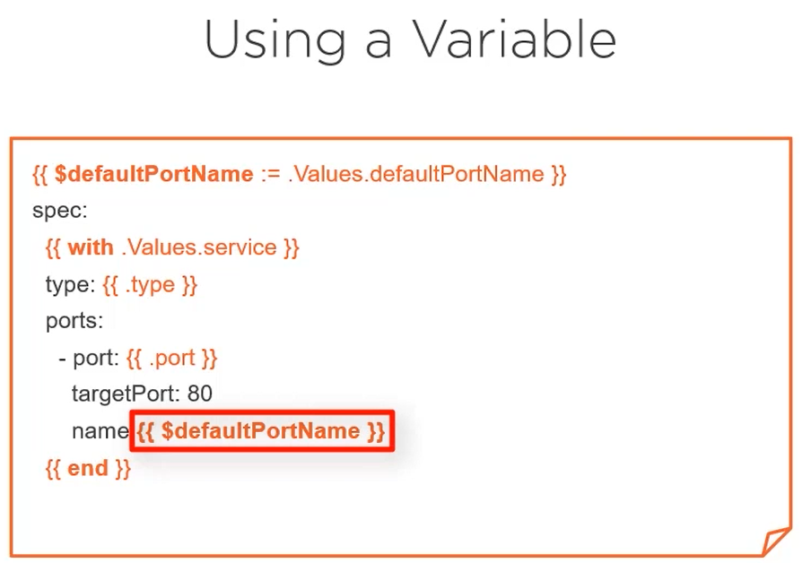

# Helm functions and pipelines


## Introduction

Helm gives us the possibility to add some logic to our charts via functions and pipelines.


You can use both, but in most of cases devops uses the pipeline syntax :



For functions, it's like in other languages but the difference with Helm is that to pass an argument you can just put a space between the function name and its parameters. For example :
- **quote value** (wich calls the quote functions with value as argument)
- **value | quote** (with pipeline you can just use)

This will add quotes to your value.

## Most used functions

Here's common used functions in Helm.


- **trunc value 63** is mostly used with long names (as kubernetes will not accept names with more than 64 characters)
- **b64enc** is mostly used with password to encode them

We will see some examples next.

You can find more functions in the Helm documentation :

- https://helm.sh/docs/chart_template_guide/functions_and_pipelines/

- https://helm.sh/docs/chart_template_guide/function_list/

These functions are provided by the **Sprig** project, so have a look also at this documentation :
- https://github.com/Masterminds/sprig/tree/master/docs

## Examples

### Trunc and trimSuffix


As the service:name has more than 64 caracters, using this technique we will truncate the name and remove the **dash** at the tail of the name (if the last trunctaed character is a hash)

### Password


In this example, we will encore the password and put it into quotes.

### With


If you don't want to precise the paths from the root each time with **.Values.service**, you can uses a scope by defining it via the **with** keyword.

A little issue here is that the with generates a return character in the manifest file. We will see the solution in the next section.

### Controlling whitespaces and Indentation

- Using the **dash**, you can control the return characters spaces.
- Using the **indent** function you can control the indentation.

Check this video for examples :
- https://app.pluralsight.com/course-player?clipId=d8fff5b4-eb00-440e-9225-8627009a3c1d

### Logical operators, if else and loops

In this video, we will talk about logical operators, how to use the if else and how to loop over an array :
- https://app.pluralsight.com/course-player?clipId=6d973518-ebfa-49dd-8b31-6d03bdc24224


But how access the hosts data from the paths range ?

Find this in the next section.

### Using Variables

Here's how you can declare a variable :


But you can find more about how to use variables and global variables in this video :
- https://app.pluralsight.com/course-player?clipId=d7d4d9d2-ced8-43ff-a31b-4fd3736c0f42

## Helper Functions and Sub-templates

With Helm, you can define sub-templates functions that can be reusable.
For example, the last **if else** example can be used in more than one template without copying/pasting it all the time.

This is called helper functions, you can find more details about how to use them here :
- https://app.pluralsight.com/course-player?clipId=5e87feb1-621f-4797-bc66-6c2084d519cd

We gonna talk ,in the same video, also about :
- .helmignore file
- _helpers.tpl files
- library charts (efficient way to use helpers)
- difference between **template** and **include**
- **notes.txt** file

## Demos

### Demo 1 : Resolve backend issue

In the :
- **backend/templates/_helpers.tpl** : We will define the *backend.fullname* variable which will the release+chart tuncated if the user did not override this with *fullnameOverride*
- **rest of files** : We replaced the *{{ .Release.Name }}-{{ .Chart.Name }}* with the *backend.fullname* as it contains our logic and if we replace this logic the changes will be done on all the files
- **backend/values.yaml** : we split the mongo uri into multiple parameters to control easily this data. By defining them in the sub-chart, we can easily override them from the parent chart.
- **backend/templates/backend-secret.yaml** : The mongodb-uri will be generated based on the mongo parameters from the *values.yaml* file. The mongo host will be **$.Release.Name "-" .dbchart** as we said before.
- **values.yaml** : this contains the admin/password to be used in the chart (will override the one declared in the backend)


You can find the demo of this chart in this video :
- https://app.pluralsight.com/course-player?clipId=a55c4832-af30-4d18-a55d-d4d4eba2dc85


````shell
helm template guestbook
````

If it's OK.

````shell
helm upgrade guestbook guestbook
````

````log
Release "guestbook" has been upgraded. Happy Helming!
NAME: guestbook
LAST DEPLOYED: Sun Mar 19 12:10:07 2023
NAMESPACE: default
STATUS: deployed
REVISION: 2
TEST SUITE: None
````

````shell
k get pods
````

````log
NAME                                  READY   STATUS    RESTARTS   AGE
guestbook-backend-669f8d789d-tztfk    1/1     Running   0          7s
guestbook-database-7c7d57b6db-sqrnp   1/1     Running   0          16h
guestbook-frontend-546c4969f6-ldpzw   1/1     Running   0          16h
````

````shell
k logs guestbook-backend-669f8d789d-tztfk
````

````log
Guestbook API listening on port 3000!
connected to the mongoDB !
````

### Demo 2 : Install multiple releases

To install multiple releases one for developers and one for testers that are completelly seperate but in the same namespaces, you have to check this demo :
- https://app.pluralsight.com/course-player?clipId=a55c4832-af30-4d18-a55d-d4d4eba2dc85

The github demo files can be found here :
- https://github.com/phcollignon/helm3/tree/master/lab9_helm_template_begin
- https://github.com/phcollignon/helm3/tree/master/lab9_helm_template_final

The demo explains :
- how to make the ingress backend and frontend optionals
- how to add a global ingress based on the release name (which will generates cnmaes based on the release name like dev.frontend.minikube.local)