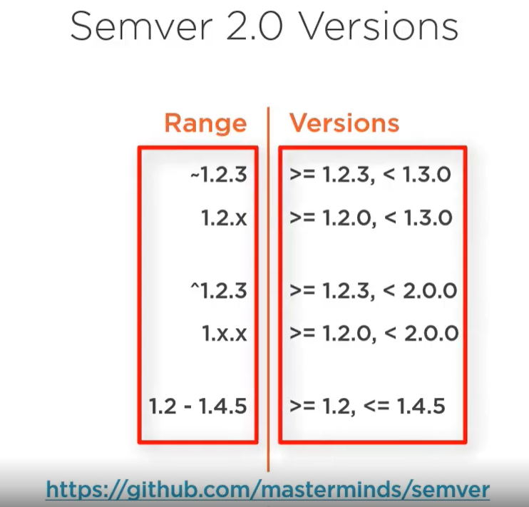
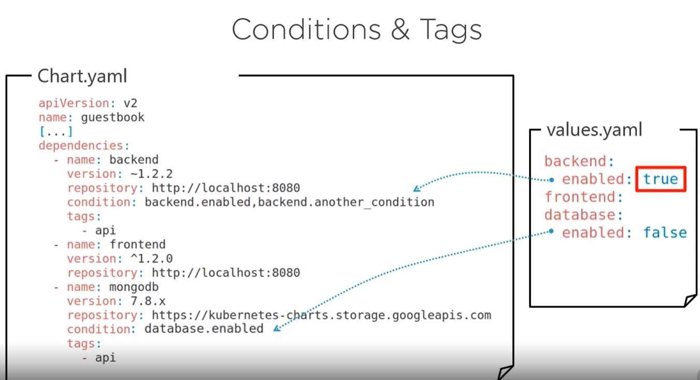
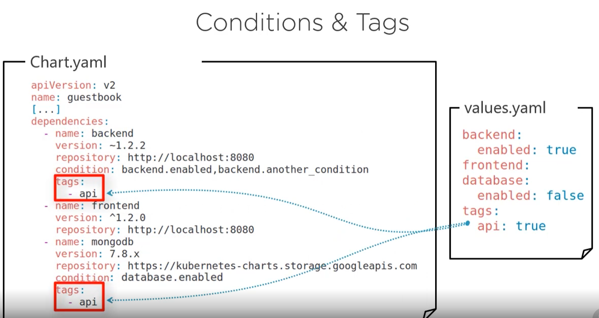

# Publishing Charts

In this demo, we will talk about how to publish a chart to a repo. You can start by this video wich explains to general steps
to follow to achieve this goal :
- https://app.pluralsight.com/course-player?clipId=475efee0-1bb9-4730-870b-03b6eee97219

## Packaging and Publishing charts

### Packaging

You can start by moving the charts into a **dist** directory.

````shell
mv guestbook/charts dist
````

create the helm packages of the different charts :

````shell
cd dist && helm package frontend backend database
````

````log
Successfully packaged chart and saved it to: /home/dali/workspace-pluralsight/helm-tutorial/publishing_charts/dist/frontend-1.2.0.tgz
Successfully packaged chart and saved it to: /home/dali/workspace-pluralsight/helm-tutorial/publishing_charts/dist/backend-1.2.0.tgz
Successfully packaged chart and saved it to: /home/dali/workspace-pluralsight/helm-tutorial/publishing_charts/dist/database-1.2.0.tgz
````

Helm packages are just tgz compressed files. it's more practical use the helm command instead of tar because helm will add the chart version to the tgz file name.

Let's remove the charts sources :

````shell
rm -rf backend database frontend
````

Now we can add the index file.

````shell
helm repo index .
````

````log
total 16K
-rwxrwxrwx 1 dali dali 1.4K Mar 21 21:08 backend-1.2.0.tgz
-rwxrwxrwx 1 dali dali 1.1K Mar 21 21:08 database-1.2.0.tgz
-rwxrwxrwx 1 dali dali 1.1K Mar 21 21:08 frontend-1.2.0.tgz
-rwxrwxrwx 1 dali dali 1.1K Mar 21 21:11 index.yaml
````

### Publishing

To publish ou charts, we just need an http server. In our case, we will use chartmuseum on a docker environment.
From the root directory of this demo, run : 

````shell
docker-compose up
````

````log
Attaching to publishing_charts_chartmuseum_1
chartmuseum_1  | 2023-03-21T20:19:49.438Z       DEBUG   Fetching chart list from storage        {"repo": ""}
chartmuseum_1  | 2023-03-21T20:19:49.445Z       DEBUG   Change detected between cache and storage       {"repo": ""}
chartmuseum_1  | 2023-03-21T20:19:49.445Z       DEBUG   Regenerating index.yaml {"repo": ""}
chartmuseum_1  | 2023-03-21T20:19:49.445Z       DEBUG   Loading charts packages from storage (this could take awhile)   {"repo": "", "total": 3}
chartmuseum_1  | 2023-03-21T20:19:49.471Z       DEBUG   Adding chart to index   {"repo": "", "name": "frontend", "version": "1.2.0"}
chartmuseum_1  | 2023-03-21T20:19:49.471Z       DEBUG   Adding chart to index   {"repo": "", "name": "backend", "version": "1.2.0"}
chartmuseum_1  | 2023-03-21T20:19:49.473Z       DEBUG   Adding chart to index   {"repo": "", "name": "database", "version": "1.2.0"}
chartmuseum_1  | 2023-03-21T20:19:49.474Z       DEBUG   index.yaml regenerated  {"repo": ""}
chartmuseum_1  | 2023-03-21T20:19:49.475Z       DEBUG   Entry saved in cache store      {"repo": ""}
chartmuseum_1  | 2023-03-21T20:19:49.475Z       INFO    Starting ChartMuseum    {"port": 8080}
chartmuseum_1  | 2023-03-21T20:19:49.480Z       DEBUG   index-cache.yaml saved in storage       {"repo": ""}
````

You can see that the charts has been loaded to the server and it is listenning on the 8080 port. You can request the list of charts like below :

````shell
curl http://localhost:8080/api/charts | jq
````

````log
{
  "backend": [
    {
      "name": "backend",
      "version": "1.2.0",
      "description": "A Helm chart for Guestbook Backend 1.0",
      "apiVersion": "v2",
      "appVersion": "1.0",
      "urls": [
        "charts/backend-1.2.0.tgz"
      ],
      "created": "2023-03-21T20:08:56.1363967Z",
      "digest": "358eaa641336fc58a0d1749aef4027bdaf86346e57b29432a81d377c690886fc"
    }
  ],
  "database": [
    {
      "name": "database",
      "version": "1.2.0",
      "description": "A Helm chart for Guestbook Database Mongodb 3.6",
      "apiVersion": "v2",
      "appVersion": "3.6",
      "urls": [
        "charts/database-1.2.0.tgz"
      ],
      "created": "2023-03-21T20:08:56.2070019Z",
      "digest": "cc97a20b20e2bc9709ad10315b04df71a3ae3471015b051f0c785567ea0e9107"
    }
  ],
  "frontend": [
    {
      "name": "frontend",
      "version": "1.2.0",
      "description": "A Helm chart for Guestbook Frontend 2.0",
      "apiVersion": "v2",
      "appVersion": "2.0",
      "urls": [
        "charts/frontend-1.2.0.tgz"
      ],
      "created": "2023-03-21T20:08:56.0649983Z",
      "digest": "8e39c41148f77f624f957f656942b0ae9bf205807867958777efb013cb04cb29"
    }
  ]
}
````

PN : We only need to upload the tgz files and not the index.yaml

## Dependencies, Conditions and Tags

### Dependencies

Well our guestbook chart dependes on the backend, frontend and database charts. To create this dependecy, you can place the **tgz** charts under the **guestbook/charts** folder but this is the manual way.

To make dependencies, you can add them to the **Chart.yaml** file.
````yaml
apiVersion: v2
name: guestbook
appVersion: "2.0"
description: A Helm chart for Guestbook 2.0 
version: 1.2.0
type: application
dependencies:
  - name: backend
    version: ~1.2.2
    repository: http://localhost:8080
  - name: frontend
    version: ^1.2.2
    repository: http://localhost:8080
  - name: mongodb
    version: 7.8.x
    repository: https://charts.helm.sh/stable
````

The charts version follows the Go semver syntax.
- https://github.com/Masterminds/semver



To downoad the dependencies to your chart, you can simply run :

````shell
helm dependency update guestbook
````

You can check which dependencies are available by running :
````shell
helm dependency list guestbook
````

If there are some changes in the required charts, you can run **helm dependency update** again to synchronize the changes.

````log
NAME            VERSION REPOSITORY                      STATUS
backend         ~1.2.2  http://localhost:8080           missing
frontend        ^1.2.2  http://localhost:8080           missing
mongodb         7.8.x   https://charts.helm.sh/stable   missing
````

Well, i had this output because i didn't yet updated the charts. Now if i run **helm dependency update** :

````shell
helm dependency update guestbook
````

When you do this, helm will create also the **Chart.lock** file which contains a fix list of your dependencies.
Later on, if you would like to build your release without having compatiblity issues with the new dependencies versions, you can use the **Chart.lock** dependencies list by running :

````shell
helm dependency build guestbook
````

### Consitions and Tags

You can install charts based on the some conditions, to do so you can use the condition property :



For multi-conditions, they will be evaluated in their order of appereance. The first evaluated to true will stop the rest of the evaluation process.
It the condition property does not exist in the **values.yaml**, it will be evaluated to true.
If for example, the **database.enabled** doest not existe, the database chart will be installed.

You also achieve the same result using tags.



By making tags, you can make some dependecies optional.
Conditions override tags which means that tags will only work if the conditions does not exist.

PN : that conditions and tags will be evaluated on the installation of the chart and not on the update. On update, helm will download all the dependencies.

## Demo

### Dependencies Demo

````shell
helm repo add chartmuseum http://localhost:8080 && helm repo list
````

````log
"chartmuseum" has been added to your repositories

NAME            URL
stable          https://charts.helm.sh/stable
chartmuseum     http://localhost:8080
````

Now you can pull the lastest helm charts information from the repository.

````shell
helm repo update
````

````log
...Successfully got an update from the "chartmuseum" chart repository
...Successfully got an update from the "stable" chart repository
Update Complete. ⎈Happy Helming!⎈
````

Let's search for charts available inside the chartmuseum repository :

````shell
helm search repo chartmuseum
````

````log
NAME                    CHART VERSION   APP VERSION     DESCRIPTION
stable/chartmuseum      2.14.2          0.12.0          DEPRECATED Host your own Helm Chart Repository
chartmuseum/backend     1.2.0           1.0             A Helm chart for Guestbook Backend 1.0
chartmuseum/database    1.2.0           3.6             A Helm chart for Guestbook Database Mongodb 3.6
chartmuseum/frontend    1.2.0           2.0             A Helm chart for Guestbook Frontend 2.0
````

Now, you can add these dependencies to the **guestbook/Chart.yaml** file and run this command :

````shell
helm dependency update guestbook
````

````log
Hang tight while we grab the latest from your chart repositories...
...Successfully got an update from the "chartmuseum" chart repository
...Successfully got an update from the "stable" chart repository
Update Complete. ⎈Happy Helming!⎈
Saving 3 charts
Downloading backend from repo http://localhost:8080
Downloading frontend from repo http://localhost:8080
Downloading database from repo http://localhost:8080
Deleting outdated charts
````

The downloaded charts will be found under the **guestbook/charts** directory.

````shell
ll guestbook/charts
````

````log
total 12K
-rwxrwxrwx 1 dali dali 1.4K Mar 22 21:35 backend-1.2.0.tgz
-rwxrwxrwx 1 dali dali 1.1K Mar 22 21:35 database-1.2.0.tgz
-rwxrwxrwx 1 dali dali 1.1K Mar 22 21:35 frontend-1.2.0.tgz
````

You'll also find the **Chart.lock** file under **guestbook** with stable versions.
Let's list the dependencies :

````shell
helm dependency list guestbook
````

````log
NAME            VERSION REPOSITORY              STATUS
backend         ~1.2.0  http://localhost:8080   ok
frontend        ^1.2.0  http://localhost:8080   ok
database        ~1.2.0  http://localhost:8080   ok
````

Let's now install a **dev** release :

````shell
helm install dev guestbook
````

````log
Congratulations ! You installed guestbook chart sucessfully.
Release name is dev
Have fun !
````

A quick check :

````shell
helm list
````

````log
NAME    NAMESPACE       REVISION        UPDATED                                 STATUS          CHART           APP VERSION
dev     default         1               2023-03-22 21:54:13.2668481 +0100 CET   deployed        guestbook-1.2.0 2.0
````

````shell
helm uninstall dev guestbook
````

You can run **helm dependency build guestbook** to get stable dependencies based on the **Chart.lock** file.

### Frontend Demo

Imagine that the dev team would like to test only the frontend without the backend and the database, how can we achieve that ?

#### Using conditions

You can enable the backend and the database installation by adding conditions to the **Chart.yaml** file :

````yaml
backend:
  enabled: true
  secret:
    mongodb_uri:
      username: admin
      password: password
  ingress:
    enabled: false
frontend:
  ingress:
    enabled: false
database:
  enabled: true
````

don't forget to add the conditions to your dependencies before :

````yaml
apiVersion: v2
name: guestbook
appVersion: "2.0"
description: A Helm chart for Guestbook 2.0 
version: 1.2.2
type: application
dependencies:
  - name: backend
    version: ~1.2.2
    repository: http://localhost:8080
    condition: backend.enabled
    tags:
      - api
  - name: frontend
    version: ^1.2.0
    repository: http://localhost:8080
  - name: database
    version: ~1.2.2
    repository: http://localhost:8080
    condition: database.enabled
    tags:
      - api
````

Let's install a frontend release :

````shell
helm install dev guestbook --set backend.enabled=false --set database.enabled=false
````

#### Using tags

You achieve the same goal as above using tags.
To do so, you have to remove the conditions part as conditions will override tags and add this blog.

````yaml
backend:
  secret:
    mongodb_uri:
      username: admin
      password: password
  ingress:
    enabled: false
frontend:
  ingress:
    enabled: false
tags:
  api: true
````

Let's install a frontend release :

````shell
helm install dev guestbook --set tags.api=false
````

don't forget to tag your dependencies before (and remove conditions) :

````yaml
apiVersion: v2
name: guestbook
appVersion: "2.0"
description: A Helm chart for Guestbook 2.0 
version: 1.2.2
type: application
dependencies:
  - name: backend
    version: ~1.2.2
    repository: http://localhost:8080
    tags:
      - api
  - name: frontend
    version: ^1.2.0
    repository: http://localhost:8080
  - name: database
    version: ~1.2.2
    repository: http://localhost:8080
    tags:
      - api
````